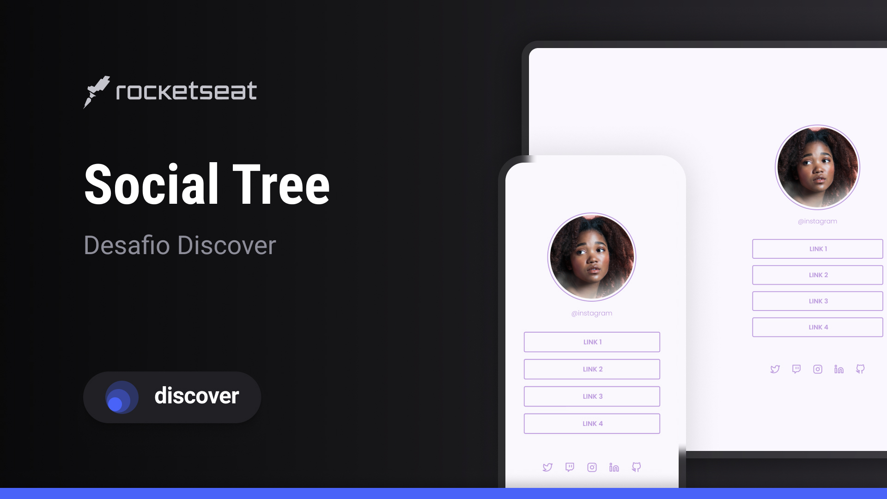

<h1 align="center"> Social Tree </h1>

Projeto exclusivo e gratuito, promovido pela Rocketseat para ensino de tecnologias WEB.

  <a href="#-tecnologias">Tecnologias</a>&nbsp;&nbsp;&nbsp;|&nbsp;&nbsp;&nbsp;
  <a href="#-projeto">Projeto</a>&nbsp;&nbsp;&nbsp;|&nbsp;&nbsp;&nbsp;
  <a href="#-layout">Layout</a>&nbsp;&nbsp;&nbsp;|&nbsp;&nbsp;&nbsp;
  <a href="#memo-licença">Licença</a>

  

 

  

## 🚀 Tecnologias

Esse projeto foi desenvolvido com as seguintes tecnologias:

- HTML e CSS
- Git e Github
- Figma

## 💻 Projeto

Social Tree, serve como agregador de links o(a) cliente.

## 🔖 Layout

Você pode visualizar o layout do projeto através [DESSE LINK](https://www.figma.com/file/JNAB2p2Ks3hg6IS1t3dE0T/DevLinks-%E2%80%A2-Projeto-Discover-(Community)?type=design&node-id=1437-191&t=WZOBoswsV41es1Wq-0). É necessário ter conta no [Figma](https://figma.com) para acessá-lo.

##   Licença

Esse projeto está sob a licença MIT.

---

